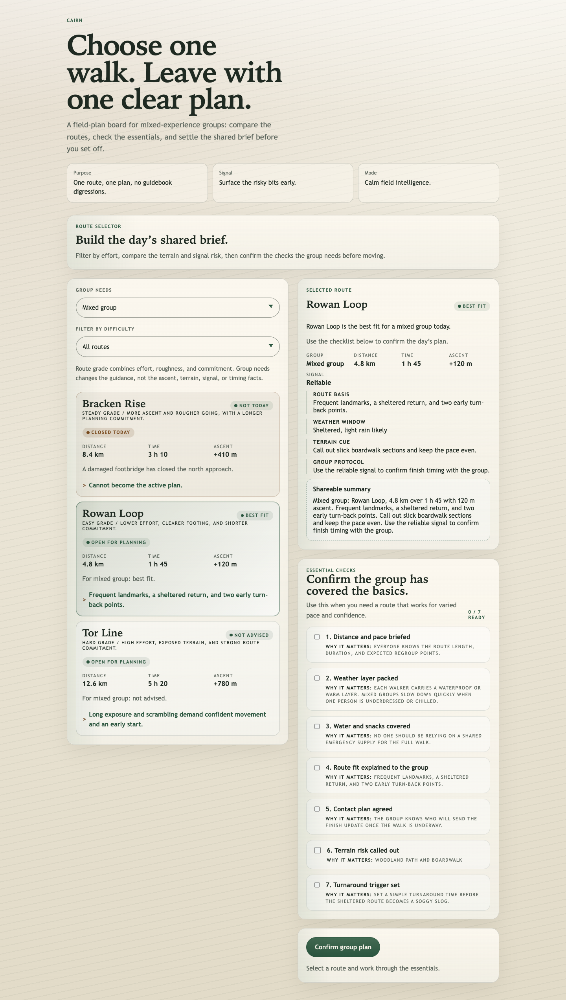

# CAIRN: SITECRAFT deep baseline benchmark

CAIRN is the current public SITECRAFT benchmark. It compares fresh Codex runs on
one evolving web-product task, with and without SITECRAFT 0.4.0.

## Result at a glance

**All four candidates passed the same functional acceptance checks.** SITECRAFT
then scored higher on average in blind visual review, but the two repetitions
split.

| Measure | Baseline | SITECRAFT 0.4.0 |
| --- | ---: | ---: |
| Candidates | 2 | 2 |
| Functional acceptance | 2/2 pass | 2/2 pass |
| Average blind visual score | 18.5/25 | **22/25** |
| Repetition 1 | 15/25 | **24/25** |
| Repetition 2 | **22/25** | 20/25 |

**Supported conclusion:** SITECRAFT produced a higher visual average and remained
active as the project changed, but this study does not prove a repeatable
output-quality advantage. One paired run favored SITECRAFT by 9 points and the
other favored baseline by 2 points.

That mixed result is intentional to publish. The benchmark's predeclared rule
requires both skilled repetitions to improve before calling a repeatable skill
advantage.

## What was tested

Each candidate went through the same three stages:

1. build the initial CAIRN experience from the frozen brief;
2. respond to new user evidence and a changed route dataset;
3. repair late QA findings and decide whether the result is actually complete.

The skilled condition was instructed to use SITECRAFT throughout the lifecycle,
not only at the beginning. Both SITECRAFT candidates reopened the skill in all
three stages.

### Recorded environment

- Model: `gpt-5.4`
- Reasoning effort: `high`
- Harness: Codex CLI `0.147.0`
- SITECRAFT: `0.4.0`
- Conditions: baseline and named skill only
- Replicates: two per condition
- Stages: three per replicate

## Functional result

All four final candidates passed the same static evaluator and headless-browser
acceptance suite.

The browser evidence covers desktop, mobile, and narrow layouts, no-JavaScript
content, keyboard interaction, closed-route safety, confirmation guards, focus,
and reduced motion within the recorded test environment.

| Candidate | Condition | Static checks | Browser checks |
| --- | --- | ---: | ---: |
| baseline-1 | Baseline | Pass | Pass |
| baseline-2 | Baseline | Pass | Pass |
| skilled-1 | SITECRAFT | Pass | Pass |
| skilled-2 | SITECRAFT | Pass | Pass |

## Blind visual result

The reviewer received desktop and mobile screenshots labeled only A through D.
The condition map was revealed after grading.

| Rank | Candidate | Condition | Score / 25 |
| ---: | --- | --- | ---: |
| 1 | skilled-1 | SITECRAFT | **24** |
| 2 | baseline-2 | Baseline | **22** |
| 3 | skilled-2 | SITECRAFT | **20** |
| 4 | baseline-1 | Baseline | **15** |

The highest-ranked candidate was `skilled-1`:

See [all screenshots and browser receipts](results/evidence/) or read the
[complete blind review](results/blind-visual-review.json).

## How to inspect the evidence

Start here if you want the result rather than the implementation details:

- [Detailed result](results/RESULTS.md): full written interpretation and evidence boundary.
- [Machine-readable scores](results/results.json): final benchmark result data.
- [Blind visual review](results/blind-visual-review.json): reviewer scores and comments.
- [Execution summary](results/execution-summary.json): bounded host counters and skill-read events.
- [Final candidates](results/candidates/): the four unchanged final websites.
- [Visual and browser evidence](results/evidence/): screenshots and acceptance receipts for every candidate.

To inspect how the study was constructed:

- [Seed](seed/): frozen starting project.
- [Prompts](prompts/): baseline and skilled prompts across all three stages.
- [Injected evidence](stimuli/): the changed route data and late QA report.
- [Evaluation](evaluation/): static, browser, and blind-review tooling.
- [Shared protocol](../protocol.json): common run configuration for the deep study.

## What this result does and does not mean

This study supports a narrow statement: on this evolving static web-product task,
SITECRAFT preserved full functional acceptance, achieved a higher average blind
visual score, and was reused when evidence changed.

It does not establish production readiness, universal visual superiority,
screen-reader behavior, native-device behavior, cross-browser coverage, or an
advantage across every web task or model. More repetitions are needed to tell
how much of the visual difference came from SITECRAFT and how much came from
normal model variation.

For the wider methodology and the pending FOUNDRY study, return to the
[deep baseline study overview](../).
