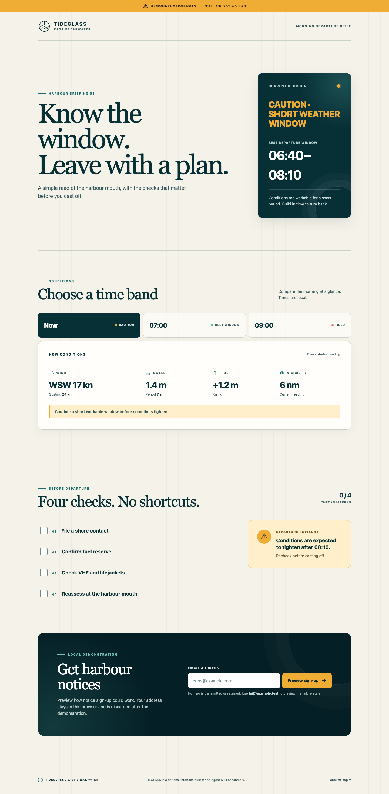
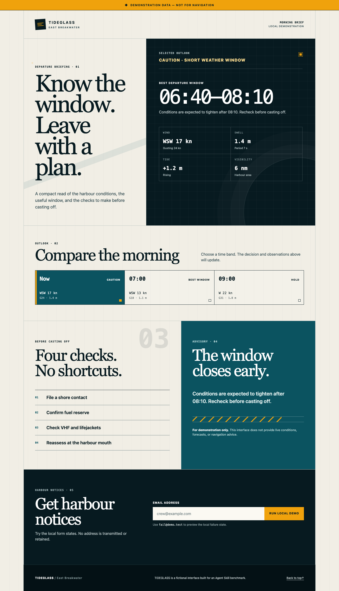
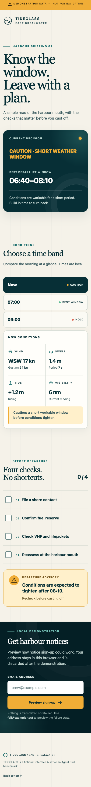
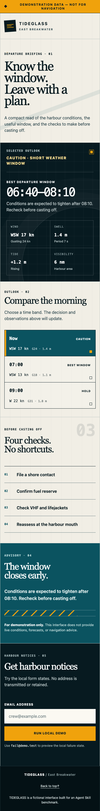

# TIDEGLASS: SITECRAFT paired showcase

Two fresh Codex agents received the same sparse brief for a fictional harbour
departure board. The baseline had no skill. The second had SITECRAFT 0.3.0
installed only inside its isolated workspace.

This run ended in near parity: **97.5/100 baseline, 97/100 with SITECRAFT**. Both
passed every declared content, interaction, accessibility-structure, local-only,
responsive, and headless-browser check. A blind reviewer scored the baseline
42.5/45 and SITECRAFT 42/45 on hierarchy, visual system, responsive quality, and
polish.

That is not evidence that SITECRAFT is worse by a meaningful amount; a 0.5-point
single-review difference is too small and model output is nondeterministic. It is
also not evidence that SITECRAFT improves this class of task. The defensible
result is **parity on one high-quality single-page build**.

## See the actual work

| Baseline | With SITECRAFT |
| --- | --- |
| [Open project](outputs/baseline/) | [Open project](outputs/with-sitecraft/) |
|  |  |
|  |  |

The baseline chose a refined public-information language with softer cards and
nautical icons. SITECRAFT chose a more austere industrial instrument-board
language with numbered sections, square status marks, and a denser operational
panel. Both designs are clearly derived from the harbour brief rather than a
generic landing-page template.

## Score construction

| Evidence layer | Baseline | With SITECRAFT |
| --- | ---: | ---: |
| Deterministic static checks | 55/55 | 55/55 |
| Browser gate | Pass | Pass |
| Blind visual/responsive review | 42.5/45 | 42/45 |
| Total | **97.5/100** | **97/100** |

The browser gate exercised desktop, 390px, 320px, reduced motion, pointer and
keyboard time selection, exposed selected state, invalid input, submitting,
success, deterministic failure, and the no-network boundary. It is not a screen
reader, native-device, production, or cross-browser certification.

The reviewer received anonymous folders A and B and inspected every screenshot.
The mapping was revealed only after grading: A was baseline; B was SITECRAFT.
Read the complete [blind review](evidence/blind-visual-review.json), [baseline
browser receipt](evidence/baseline/browser-results.json), or [SITECRAFT browser
receipt](evidence/with-sitecraft/browser-results.json).

## What improved in the skill

SITECRAFT created a large machine-shaped Experience Contract for this small,
single-surface build. It was thoughtful, but it did not improve the scored result
and was disproportionate to the project. SITECRAFT 0.3.1 now makes artifact depth
explicit: bounded single-surface work uses a compact working contract, while full
JSON is reserved for real multi-surface, multi-runtime, asset-lineage, approval,
release, or continuation needs.

The change is a scope clarification supported by SITECRAFT's existing “smallest
useful package” doctrine. Version 0.3.1 was validated structurally; this paired
output still records the 0.3.0 run and does not pretend the revision was rerun.

## Reproduce it

1. Copy `seed/` into two new workspaces.
2. Use the two frozen prompts in [prompt.md](prompt.md), installing SITECRAFT only
   in the skilled workspace.
3. Run the static evaluator:

   ```bash
   python3 evaluation/evaluate_static.py /path/to/candidate
   ```

4. With Playwright and Chrome available, run the browser evaluator:

   ```bash
   node evaluation/browser_evaluate.cjs /path/to/candidate /path/to/evidence
   ```

5. Grade screenshots blind using the predeclared [rubric](evaluation/rubric.json).

Use fresh agents and keep each condition isolated. Repeat runs before making a
general claim.
