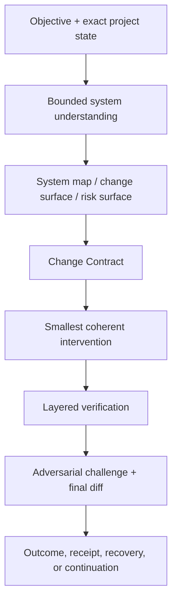

# FOUNDRY architecture

## Quick start

Use FOUNDRY for substantial software work where understanding, compatibility, risk, or proof matters.

```text
$foundry-engineering Confirm the exact repository, map the relevant behavior and state, define what may and may not change, make the smallest coherent intervention, and verify every completion claim.
```

In plain English, FOUNDRY helps an agent answer four questions:

1. What does the system actually do now?
2. What should change, and what must not change?
3. Who or what owns that behavior?
4. What evidence proves the change works in the relevant environment?

## Mission

FOUNDRY helps an agent understand, design, change, debug, repair, refactor, review, test, secure, optimize, migrate, release, and recover software.

Its central philosophy is:

> Understand first. Change deliberately. Verify reality. Preserve what already works.

FOUNDRY is language- and framework-neutral. Specialist packs deepen a task without turning today's preferred stack into permanent doctrine.

## System shape



## Core loop

### 1. Target state

Confirm the exact repository, root, checkout/worktree, branch or revision when available, dirty state, user changes, generated and vendored boundaries, and applicable instructions. Do not edit when project identity or concurrent ownership is unresolved.

### 2. Bounded understanding

Build the smallest map that explains the requested behavior:

```text
entry → owner → dependencies → state/side effects → persistence/external boundary → tests/operations
```

For large repositories, expand progressively through repository map, subsystem map, change surface, dependency neighborhood, behavioral path, state ownership, and risk surface.

Classify material claims as KNOWN, INFERRED, UNKNOWN, or NEEDS VERIFICATION. Search results are evidence candidates, not architectural understanding.

### 3. Change Contract

For consequential work, record:

- objective;
- existing and desired behavior;
- invariants and compatibility promises;
- allowed, forbidden, generated, and affected surfaces;
- behavior owner and smallest coherent change surface;
- risks and affected neighbors;
- verification plan;
- recovery and rollback;
- exact completion claims and evidence.

Small reversible edits can keep the same contract in working notes.

### 4. Deliberate intervention

Prefer an existing owner over a new service, store, queue, cache, framework, abstraction, dependency, or plugin system. Preserve local conventions unless they cause the defect or violate the contract. Keep unrelated cleanup out of the change.

### 5. Layered verification

Verification widens according to risk:

```text
syntax/type → focused behavior → regression → integration → build/package
→ runtime/state → adversarial/non-functional → exact change state
```

Claims are labelled TESTED, OBSERVED, INFERRED, or UNVERIFIED. A unit test cannot prove a deployed integration; a benchmark without a baseline cannot prove improvement; a scanner cannot prove security.

For packaging incidents, the regression must live at the artifact boundary. It
builds and inspects the distributable, installs without source-tree leakage, and
exercises the incident-relevant public success and failure contracts. A separate
evaluation receipt may widen that proof, but it cannot replace the test that
travels with the package.

### 6. Challenge and close

Run relevant vetoes: wrong owner, hidden scope, compatibility drift, weakened tests, unhappy paths, concurrency, stale state, recovery, security, integration reality, and rollback feasibility. Inspect the final diff and leave exact evidence, limitations, residual risk, and next action.

## Lifecycle re-entry

FOUNDRY remains active for the governed objective. It is reopened before the
first consequential edit, when requirements, evidence, state, failures,
ownership, environment, or handoff assumptions change, and before completion.

Only the affected engineering mode is reopened. A consequential discovery
creates a bounded child loop that inherits the parent objective, invariants, and
authority. It must close with evidence or an explicit verification gap before
the parent task continues. Valid earlier understanding is preserved rather than
rebuilding the whole repository map without cause.

## Specialist routing

FOUNDRY uses compact references for understanding, change discipline, and verification, then routes deeper material only when required:

- architecture and greenfield design;
- debugging, repair, and causal diagnosis;
- testing and evidence;
- review and behavior-preserving refactoring;
- databases, persistence, and migrations;
- concurrency, state machines, and distributed state;
- APIs, services, CLIs, libraries, and compatibility;
- frontend, desktop, mobile, and accessibility;
- security, performance, reliability, observability, incidents, and recovery;
- dependencies, builds, CI, packaging, and releases;
- AI, LLM, agent, retrieval, evaluation, and MCP/tool systems;
- research, collaboration, and continuity.

Later language or framework packs can deepen these routes without changing the core ownership and evidence model.

## Current public evidence

The repository keeps two earlier bounded FOUNDRY examples that ended in
correctness parity with a strong baseline. A deeper three-stage study has been
designed to test concurrency, migration, recovery, and installed-package
boundaries with two clean runs per condition. Its scenario and evaluator are
public, but the interrupted pilot is excluded and no deeper result is claimed
yet. See the [study status](../benchmarks/deep-baseline-study/).

## Debugging

FOUNDRY uses a falsifiable loop:

```text
symptom → reproduce → evidence → narrow scope → hypotheses → falsification
→ cause → fix cause → reproduce prior failure → regression → wider verification
```

It distinguishes symptom, proximate cause, root cause, and contributing conditions, and separates code, configuration, dependency, environment, data, timing, infrastructure, and test defects.

Random edits, sleeps, retries, cache clearing, dependency upgrades, and broad exception handling are not diagnoses.

## Collaboration and continuity

Durable work is separate from the worker executing it. A bounded assignment states ownership, dependencies, write surfaces, inputs, outputs, and proof requirements. A blocked dependency should block only dependent work. Another worker's report must be checked against fresh shared state before integration.

The Continuation Record carries objective, established findings, changed surfaces, evidence, invariants, unresolved issues, dependencies, next work, and exact references. It carries no secret, transcript, hidden reasoning, or permission.

## Failure tests

FOUNDRY rejects:

- coding after glancing at two files;
- speculative rewrites and framework churn;
- unnecessary dependencies and abstractions;
- symptom patches without causal evidence;
- deleting or weakening inconvenient tests;
- happy-path-only proof;
- generated-file and wrong-worktree edits;
- swallowed errors and invented APIs;
- unmeasured performance claims;
- cargo-cult security;
- dangerous migrations and destructive cleanup;
- ignored concurrent writers;
- unit-test success presented as live integration success;
- completion because code merely looks plausible.

## Codex and Claude Code

FOUNDRY's description front-loads substantial engineering triggers, and its compact router points directly to the smallest reference packet. Codex interface metadata is optional. Claude Code receives the same canonical package through the plugin or standalone directory. No host-specific tool list is embedded in the core.

## PC Bridge teaser

PC Bridge can strengthen exact project targeting, guarded edits, worktrees, Missions and Goals, bounded WorkAssignments and WorkerRuns, compiled context, evidence and effects, coordination, workboards, verification, and continuity. FOUNDRY supplies engineering knowledge and procedure; PC Bridge owns authority, execution effects, and canonical work state.

## Package map

- `skills/foundry-engineering/SKILL.md` — doctrine, routing, and core engineering loop.
- `references/` — compact and specialist engineering packets.
- `schemas/` — System Map, Change Contract, Verification Receipt, and Continuation Record.
- `assets/` — conservative blank templates.
- `examples/` — validated examples and scenario walkthroughs.
- `scripts/` — package, artifact, and scenario validation.
- `tests/` and `bridge_v2_tests.py` — routing, mutation, authority, evidence, and regression coverage.
