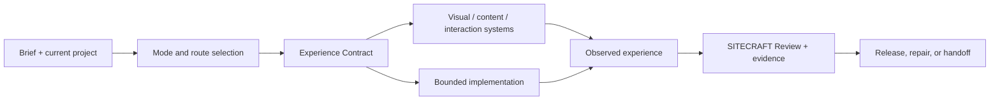

# SITECRAFT architecture

## Quick start

Use SITECRAFT when the outcome is a website or web application experience—not merely code that happens to render in a browser.

```text
$sitecraft Understand the current product and codebase, define the intended experience, make the smallest coherent change, inspect the real result, and report evidence and remaining gaps.
```

In plain English, SITECRAFT helps an agent answer four questions:

1. What should people experience?
2. What must the current product preserve?
3. What is the smallest design and implementation that satisfies the brief?
4. What real evidence proves the experience works?

## Mission

SITECRAFT helps an agent plan, design, build, repair, audit, and harden coherent websites and web applications.

Its central distinction is simple: code that runs is not proof that an experience works. Strategy, hierarchy, visual grammar, interaction, responsive composition, accessibility, performance, privacy, implementation, and release evidence must describe the same product.

## System shape



## Routes and modes

Routes describe the responsibility being exercised:

1. **Frame** — purpose, audience, constraints, success, and boundaries.
2. **Map** — content, tasks, states, recovery, orientation, and information structure.
3. **Compose** — hierarchy, visual grammar, typography, color, imagery, and responsive composition.
4. **Choreograph** — interaction, motion, interruption, continuity, and fallbacks.
5. **Build** — implementation route, components, runtime ownership, and capability decisions.
6. **Observe** — browser, device, input, accessibility, performance, and behavioral evidence.
7. **Harden** — defects, privacy, security, compatibility, rollback, and release readiness.

Modes describe the work posture: Sketch, Make, Repair, Audit, or Evolve. A task uses only the routes it needs.

## Canonical artifacts

### Experience Contract

The Experience Contract owns consequential experience decisions. It can cover:

- audience, purpose, tasks, and success;
- content and state architecture;
- visual grammar and project-specific distinction;
- responsive behavior;
- accessibility and motion equivalents;
- image, video, asset lineage, and rights;
- implementation capabilities and runtime ownership;
- performance, privacy, security, and release evidence;
- rollback and continuity.

Optional systems stay optional. A project without generated video should not complete a generated-video form merely because the schema supports it.

### SITECRAFT Review

The review records observed defects, blocking floors, evidence, confidence boundaries, and repair priority. It does not silently rewrite the Experience Contract.

### Handoff Packet

The packet references current contract state, evidence, blockers, capability profile, and next action. It carries no permissions, secrets, private transcript, or hidden reasoning.

## Progressive knowledge

SITECRAFT starts with compact routing, visual, evidence, capability, media, motion, portability, repair, and release references. Deep references load only for the active decision.

Examples:

- generated images: reference-role stack, still-master approval, production graph, derivatives, rights, and evidence;
- generated video: shot and continuity plan, provider discovery, attempt/spend limits, actual-artifact inspection, and static/reduced-motion fallback;
- motion: purpose, state handoffs, interruption, responsive transformation, performance, and fallback;
- existing codebases: inspect conventions and current behavior before imposing a new system;
- platforms: distinguish promised support from evidence collected on exact operating systems, engines, inputs, and assistive technology.

## Simplicity rule

SITECRAFT does not prescribe a framework or aesthetic. It prefers the lightest architecture that preserves the intended experience. Creative distinction must come from the project's brief, not a reusable house style or a tool's favorite effect.

Generated media providers are optional transports. The portable package contains planning and verification rules, not active provider configuration or credentials.

## Evidence model

Different claims need different evidence:

| Claim | Relevant evidence |
| --- | --- |
| Visual hierarchy at a viewport | Current rendered capture at that viewport |
| Keyboard behavior | Observed keyboard traversal and state behavior |
| Responsive support | Observations across declared widths, content stress, and input modes |
| Accessibility | Automated checks plus scoped human/assistive-technology observation where promised |
| Performance | Measured profile, trace, or field/lab metric in a named environment |
| Generated media quality | Inspection of the actual output, not its prompt or thumbnail |
| Release readiness | Current contract, review, evidence, public/private separation, rollback, and owner approval |

SITECRAFT begins with ordinary evidence and escalates diagnostics only when a real defect remains unexplained.

## Failure tests

The skill rejects:

- generic section stacking;
- references becoming a second design system;
- novelty invented to complete a template;
- motion without purpose or fallback;
- desktop shrinkage presented as responsive design;
- screenshots presented as interaction proof;
- generated-media spending without bounds;
- implementation choices made from stale or guessed package versions;
- private/debug material in public builds;
- release claims without current evidence.

## Codex and Claude Code

The compact core is small enough for both hosts and uses direct relative references. Codex receives optional interface metadata. Claude Code receives the same core through the repository plugin or a standalone skill directory. Neither host adapter grants browser, file, provider, deployment, or spending authority.

## PC Bridge teaser

With PC Bridge, SITECRAFT can gain guarded project targeting, rollback, durable missions, capability discovery, evidence and provenance, staged verification, and compact continuation. SITECRAFT still owns web-experience knowledge; PC Bridge owns authority, effects, and canonical execution state.

## Package map

- `skills/sitecraft/SKILL.md` — compact doctrine and operating route.
- `references/` — progressive web craft and operating modules.
- `schemas/` — Experience Contract, Review, Handoff, media workflow, and learning candidate.
- `assets/` — blank templates and ledgers.
- `examples/` — validated neutral examples.
- `scripts/` — package, artifact, and workspace validation.
- `tests/` and `bridge_v2_tests.py` — routing, mutation, portability, and regression coverage.

SITECRAFT's current public package deliberately excludes the prior development `build/` tree, browser profiles, logs, generated forward-test sites, showcases, and active provider adapters. That reduces the canonical package from hundreds of megabytes to the actual runtime system.
